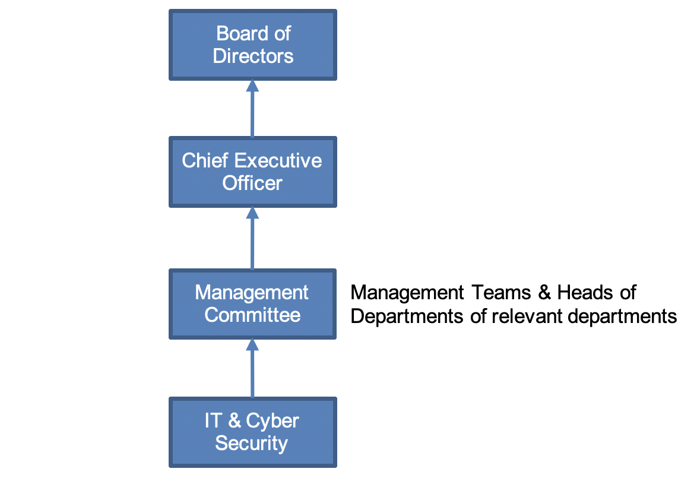

 **Internal** 

# **Information Security**

| Document Title | Information Security Management System Manual |
| --- | --- |
| Organization Name | Agile Lab |
| Document No. | ISMS-01 |
| Revision No. | 0.6 |
| Effective Date | 19 April 2021 |
| Classification | Internal |

## Revision History

| **Date** | **Rev. No.** | **Page No.** | **Description of Amendments** |
| --- | --- | --- | --- |
| 19 Apr 2021 | 0.6 | - | Update of [Policy](#policy) content |
| 15 Apr 2021 | 0.5 | - | Update of Content |
| 13 Apr 2021 | 0.5 | - | Update of Objective and measurement and content |
| 12 Apr 2021 | 0.4 | - | Update Approved By |
| 03 Apr 2021 | 0.3 | - | Content update |
| 31 Mar 2021 | 0.2 | - | Content update |
| 25 Mar 2021 | 0.1 | - | Final version for release |
| 12 Dec 2020 | 0.0 | - | Initial version for release |

### **Prepared By:**
| **Name** | **Designation** | **Date** |
| --- | --- | --- |
| Wayne Tng | Technical Leader | 19 Apr 2021 |

### **Reviewed By :**
| **Name** | **Designation** | **Date** |
| --- | --- | --- |
| SzeTho ChangSheng | Information Security Manager | 19 Apr 2021 |

### **Approved By :**
| **Name** | **Designation** | **Date** |
| --- | --- | --- |
| Sujata Liao | Director | 19 Apr 2021 |

# Contents

- [Revision History](#revision-history)

- [Policy](#policy)

- [Scope](#scope)

- [Objectives And Measurement](#objectives-and-measurement)

- [Risk Management](#risk-management)

- [Information Security Definitions](#information-security-definitions)

- [Information Security Responsibilities](#information-security-responsibilities)

- [Information Classification](#information-classification)

- [Computer And Information Control](#computer-and-information-control)

- [Asset Management](#asset-management)

- [Security Incident Reporting](#security-incident-reporting)

- [Compliance](#compliance)

- [Password Control Standards](#password-control-standards)

- [Encryption](#encryption)

  - [Definition](#definition)

  - [Encryption Key](#encryption-key)

  - [Installation of authentication and encryption certificates on the e-mail system](#installation-of-authentication-and-encryption-certificates-on-the-e-mail-system)

  - [Use of WinZip encrypted and zipped e-mail](#use-of-winzip-encrypted-and-zipped-e-mail)

  - [File Transfer Protocol (FTP)](#file-transfer-protocol-ftp)

  - [Secure Socket Layer (SSL) Web Interface](#secure-socket-layer-ssl-web-interface)

- [Change Management](#change-management)

- [Data Privacy](#data-privacy)

- [Specific Protocols And Devices](#specific-protocols-and-devices)

  - [Wireless Usage Standards and Policy](#wireless-usage-standards-and-policy)

  - [Use of Transportable Media, Personal Digital Assistants (PDAs)](#use-of-transportable-media-personal-digital-assistants-pdas)

- [Intellectual Property Rights](#intellectual-property-rights)

- [Related Documents](#related-documents)

# Policy

  1. It is the policy of Agile Lab Pte Ltd (hereinafter referred to as Agile Lab or the Organisation) that information, in all its forms – written, spoken, recorded electronically or printed – will be protected from accidental and intentional unauthorized modification, destruction or disclosure throughout its life cycle.
  2. The scope of the protection encompasses the level of security of the equipment and software used to process, store, and transmit that information.
  3. The Policy and the Information Security Management System (ISMS) shall comply with the relevant legal and regulatory requirements, and also comply with the relevant internal policies and appropriate contractual obligations.
  4. The governance structure is illustrated in the diagram below.

  

  5. All policies and procedures must be documented and made available to individuals responsible for their implementation and compliance. All activities identified by the policies and procedures must also be documented.
  6. Documentation pertaining to ISMS policies and procedures in electronic form, must be retained for at least one (1) year after initial creation or after changes are made.
  7. All documentation must be reviewed annually (once a year), or whenever required to ensure relevance and effectiveness; that is, whenever there are significant changes.
  8. At each entity and/or department level, standard operating procedures may be developed detailing the implementation of this policy and set of standards, and addressing any additional information systems functionality in such entity and/or department.
  9. All departmental procedures must be consistent with this policy.
  10. All systems implemented after the effective date of these policies are expected to comply with the provisions of this policy where practicable.
  11. Existing systems are expected to be brought into compliance where possible and within practical timeframes.
  12. The certification scope is for Software Development and Related System Integration.

# Scope

1. The primary scope of information security is the protection of the confidentiality, integrity and availability of information.
2. The framework for managing information security in this policy applies to all the departments and functions, including the employees from all the entities (that is, subsidiaries), fully or partially owned by Agile Lab.
3. This policy and all standards apply to the classes of information in any form as defined in [Information Classification](#information-classification).

# Objectives And Measurement

1. The general objective of the information security management system is to minimize losses and damages caused by potential information security incident; to continue to achieve the organization&#39;s business objectives, mission and vision.
2. The specific objectives are listed in the following table:

| **Capability or Competency Area** | **Measurement Criteria** |
| --- | --- |
| Files containing particulars, information and/or private data | Measured by incident report declared via PagerDuty |
| Data privacy and protection for intellectual property and confidential records for the organization and clients | Measured by incident report declared via PagerDuty |
| Vulnerability protection on server environment | Web: To conduct VAPT yearly   Server: Sopho Scan   Source Code: Sonarqube   Based on [criticality](https://gitlab.com/agilelab/isms-policy/-/tree/master/13%20Incident%20mgt)|

3. The Information Security Manager (ISM) is responsible to review existing and set new ISMS objectives.
4. The objectives for the specific security controls or groups of controls are proposed by the Technical Leader (TL), and will be approved by the ISM.
5. All objectives will be reviewed at least once annually, or as and when there are significant changes.
6. Agile Lab will measure the fulfilment of the objectives.
7. The measurements will be performed at least once a year by the SA/TL.
8. The SA will analyse and evaluate the measurement results and report them to the TL as input materials for the Management review.

# Risk Management

1. Risk assessments shall be conducted annually or whenever appropriate to identify the threat vulnerabilities and evaluate the risks to information networks and systems.
2. The types of threats – internal or external, natural or manmade, electronic and non-electronic – that may potentially affect the ability to manage the information and communication resources will be identified.
3. The vulnerabilities within each entity which potentially expose the information or communication resource to the threats should also be documented.
4. The assessment includes an evaluation of the information assets and the technology associated with its collection, storage, dissemination and protection.
5. From the combination of threats, vulnerabilities, and asset values, an estimate of the risks to the confidentiality, integrity and availability of the information will be determined.
6. Based on the periodic assessment, measures that reduce the impact of the threats by reducing the amount and scope of the vulnerable areas, will be implemented.
7. The selected controls are listed in the Statement of Applicability.

# Information Security Definitions

1. **Availability:** Data or information is accessible and usable when required by an authorized person.
2. **Confidentiality:** Data or information is made available or disclosed to authorised persons or processes based on the access rights privileges.
3. **Personal Data Protection Act:** The Personal Data Protection Act (PDPA) establishes a data protection law that comprises various rules governing the collection, use, disclosure and care of personal data. It recognises both the rights of individuals to protect their personal data, including rights of access and correction, and the needs for Agile Lab to collect, use or disclose personal data for legitimate and reasonable purposes.
4. **Integrity:** Data or information has not been altered or destroyed in an unauthorized manner.
5. **Involved Systems:** All information and communications technology (ICT) systems that are operated within Agile Lab&#39;s environment. This includes all platforms (hardware and operating or systems software), all computer sizes (personal digital assistants, desktops, mainframes, etc.), and all applications and data (whether developed in-house or licensed from third parties) contained on those systems.
6. **Information Security:** preservation of confidentiality, integrity and availability of information.
7. **Information Security Management System** : part of overall management processes that takes care of planning, implementing, maintaining, reviewing, and improving the information security.
8. **Risk:** The probability of a loss of confidentiality, integrity, or availability of information resources.

# Information Security Responsibilities

1. Technical Leader (TL): The role of the TL can be delegated to the SA, and is responsible to:

    1. Assist the Management Representative (TL) to develop and implement the information security policy.
    2. Assist the Manager and users to develop and implement relevant procedures and standards to comply with the information security policy.
    3. Provide basic security support for all systems and users.
    4. Advise owners in the identification and classification of computer resources.
    5. Advise systems development and application owners in the implementation of security controls for information on systems, from the point of system design, through testing and production implementation.
    6. Provide relevant information and educate management about security controls affecting system users and application systems.
    7. Perform security audits.
    8. Report regularly to the management on the organizational status with regard to information security.

2. Information Owner: The owner of a collection of information is usually the manager responsible for the creation of that information or the primary user of that information. This role often corresponds with the management of the team. In this context, ownership does not signify proprietary interest, and ownership may be shared. The owner may delegate ownership responsibilities to the department employees. The owner of information has the responsibility for:

    1. Knowing the information for which she/he is responsible.
    2. Work with the TL or SA to determine the data retention period for the information.
    3. Ensure appropriate procedures are practised to protect the integrity, confidentiality, and availability of the information used or created within the unit.
    4. Authorize access and assigning to employees as custodians for the information.
    5. Specify and communicate the control requirements to the custodian and users of the information.
    6. Report promptly to the TL or SA – the loss or misuse of organizational information.
    7. Initiate corrective actions when problems are identified.
    8. Promote employee information security education and awareness by utilizing programs approved by the TL, where appropriate.
    9. Follow existing approval processes within the Organisation for the selection, budgeting, purchase, and implementation of any computer system/software to manage information.

3. Custodian: The custodian of information is generally responsible for the processing and storage of the information. The custodian is responsible for the administration of controls as specified by the owner. Responsibilities may include:

    1. Providing and/or recommending physical safeguards.
    2. Providing and/or recommending procedural safeguards.
    3. Administering access to information.
    4. Releasing information as authorized by the Information Owner, the TL or SA for use and disclosure using procedures that protect the privacy of the information.
    5. Comply with information security policies, procedures and standards as appropriate and in consultation with the TL or SA.
    6. Reporting promptly to the Information Owner, TL or SA, the loss or misuse of any information.
    7. Identifying and responding to security incidents and initiating appropriate actions when problems are identified.

4. User: The user is any person who has been authorized to read, enter, or update information. A user of information is expected to:

    1. Access information only in support of their authorized job responsibilities.
    2. Comply with information security policies, procedures and standards, and with all controls established by the owner and custodian.
    3. Keep personal authentication devices (e.g. passwords, security tokens, PINS, etc.) confidential.
    4. Report promptly to the TL or SA the loss or misuse of information.
    5. Initiate corrective actions when problems or incidents are identified.

# Information Classification

1. Classification is used to assert proper controls for safeguarding the confidentiality of information.
2. Regardless of classification the integrity and accuracy of all classifications of information must be protected.
3. The classification assigned and the related controls applied are dependent on the sensitivity of the information. Information must be classified according to the most sensitive detail it includes. Information recorded in several formats (e.g., source document, electronic record, report) must have the same classification regardless of format.
4. The following levels are to be used when classifying information:

| **Category** | **Description** |
| --- | --- |
| Confidential | Information and data that shall be shared with designated individuals or groups (which may consist of internal and/or external parties) |
| Internal | Information and data that may be disseminated only internally, that is, to management and employees |
| Public | Information and data that is published or publicly available |

5. Contents stored in the public, organizational, confidential and private folders in the network shared drive shall be categorized using the classification categories shown above.
6. Email contents in the public, organizational, confidential and private folders shall be categorized using the classification categories shown above.

# Computer And Information Control

1. All involved systems and information are assets belonging to the Organisation.
2. The assets are expected to be protected from misuse, unauthorized manipulation and destruction. These protection measures may be physical and/or logical (procedural or software based) controls.

    1. **Ownership of Software:** All computer software developed by the Organisation&#39;s employees or contract personnel on behalf of the Organisation or licensed for the Organisation to use is the property of the Organisation; such software must not be copied for personal use, unless otherwise specified by the license agreement.
    2. **Installed Software:** All software packages that reside on computers and networks within the Organisation must comply with applicable licensing agreements and restrictions and must comply with Agile Lab&#39;s acquisition policies.
    3. **Virus Protection:** Virus checking systems approved by the TL or SA must be deployed using a multi-layered approach (desktops, servers, etc.), that ensures all electronic files are appropriately scanned for viruses. Users are not authorized to turn off or disable virus checking systems. The SA may check and verify if the virus definition files are updated on the servers, desktops or notebooks, and if the systems are infected.
    4. **Access Controls:** Physical and electronic access to Confidential and Internal information and computing resources is controlled. To ensure appropriate levels of access by employees, a variety of security measures as recommended by the SA, and approved by the TL, will be implemented. Mechanisms to control access to Confidential and Internal information include (but are not limited to) the following methods:

        1. **Authorization:** Access will be granted on a least privilege access basis and must be authorized by the immediate supervisor and application owner with the assistance of the SA. Any of the following methods are acceptable for providing access under this policy:

            - _Context-based access:_ Access control based on the context of a transaction (as opposed to being based on attributes of the initiator or target). The &quot;external&quot; factors might include time of day, location of the user, strength of user authentication, etc.
            - _Role-based access:_ An alternative to traditional access control models (e.g., discretionary or non-discretionary access control policies) that permits the specification and enforcement of enterprise-specific security policies in a way that maps more naturally to an Organisation&#39;s structure and business activities. Each user is assigned to one or more predefined roles, each of which has been assigned the various privileges needed to perform that role.
            - _User-based access:_ A security mechanism used to grant users of a system access based upon the identity of the user.

        2. **Identification/Authentication:** Unique user identification (user id) and authentication is required for all systems that maintain or access to Confidential and/or Internal Information. Users will be held accountable for all actions performed on the system with their user id.

- At least one of the following authentication methods must be implemented:

  - **strictly** controlled passwords (E.G: Password Control Standards Guidelines),
  - tokens in conjunction with a PIN.
  - SSH access

- The user must secure his/her authentication control (e.g. password, token) such that it is known only to that user and possibly a designated security manager.
- An automatic timeout re-authentication function, after a certain period of no activity (maximum 15 minutes), is preferred.
- The user must log off or secure the system when leaving it.

    1. **Review of Access Rights:** Owners of each system and/or facilities for which special access rights are required must review whether the access rights granted are in line with the current business and security requirements. The frequency of review is as listed in the following table:

| **Name of system / network / service / physical area** | **Intervals for regular review** |
| --- | --- |
| Office | Once per year; or whenever there are significant changes |
| Third party software | Once per year; or whenever there are significant changes |

  1. **Data Integrity:** the Organisation shall ensure that Confidential and Internal Information has not been altered or destroyed in an unauthorized manner. Listed below are some methods that support or protect data integrity:

      1. [disk redundancy](https://docs.aws.amazon.com/AWSEC2/latest/UserGuide/raid-config.html) (RAID)
      2. [ECC](https://aws.amazon.com/ec2/faqs) (Error Correcting Memory)
      3. [encryption of data in storage](https://docs.aws.amazon.com/AWSEC2/latest/UserGuide/EBSEncryption.html)

  2. **Transmission Security:** Technical security mechanisms must be put in place to guard against unauthorized access to data that is transmitted over a communications network, including wireless networks. The following features must be implemented:

    1. integrity controls and
    2. encryption, where deemed appropriate

  3. **Remote Access:** Access into the Organisation servers from outside will be granted using organizational approved devices and pathways on an individual user and application basis. Remote access will be provisioned using the organizational approved device SSH access secure. All other network access options are strictly prohibited. Further, Confidential and/or Internal Information that is stored or accessed remotely must maintain the same level of protections as information stored and accessed within the organizational network.
  4. **Physical Access:** Access to areas in which information processing is carried out must be restricted to only appropriately authorized individuals.

      The following physical controls must be in place:

      1. Workstations or personal computers (PC) must be secured against use by unauthorized individuals.

          - Position workstations to minimize unauthorized viewing of protected or confidential information.
          - Grant workstation access only to those who need it in order to perform their job function.
          - Establish workstation location criteria to eliminate or minimize the possibility of unauthorized access to protected and confidential information.
          - Employ physical safeguards as determined by risk analysis, such as locating workstations in controlled access areas or installing covers or enclosures to preclude passer-by access.
          - Use automatic screen savers with passwords to protect unattended machines.

      4. Facility access controls must be implemented to limit physical access to electronic information systems and the facilities in which they are housed, while ensuring that properly authorized access is allowed. The key controls are:

          - Visitors will be required to fill up the visitor logs book.
          - Visitors will be escorted at all times within the office. Unescorted visitors will have no access to the premises.

  5. **Emergency Access**:

    1. IT will provide a mechanism to provide emergency access to systems and applications in the event that the assigned custodian or owner is unavailable during an emergency.
    2. Procedures must be documented to address:

        - Authorization,
        - Implementation, and
        - Revocation

  6. **Equipment and Media Controls:** The disposal of information must ensure the continued protection of Confidential and Internal Information. Each department shall adhere to the policies and procedures that govern the receipt and removal of hardware and electronic media that contain information into and out of a facility, and the movement of these items within the facility. The following specification must be addressed:

    1. Information Disposal / Media Re-Use of:

        - Hard copy (paper and microfilm/fiche)
        - Magnetic media (floppy disks, hard drives, USB drive, etc.) and
        - CD ROM Disks

    2. **Accountability:** Each entity must maintain a record of the movements of hardware and electronic media and any person responsible therefore.
    3. **Data backup and Storage:** When needed, create a retrievable, exact copy of electronic before movement of equipment.

  7. **Other Media Controls**:

    1. Confidential Information stored on external media (diskettes, cd-roms, portable storage, memory sticks, etc.) must be protected from theft and unauthorized access. Such media must be appropriately labelled so as to identify it as Confidential Information. Further, external media containing Confidential Information must never be left unattended in unsecured areas.
    2. Confidential Information must never be stored on mobile computing devices (laptops, personal digital assistants (PDA), smart phones, tablet PC&#39;s, etc.) unless the devices have the following minimum security requirements implemented:

        - Power-on passwords
        - Auto logoff or screen saver with password
        - Encryption of stored data or other acceptable safeguards approved by TL or SA

        Furthermore, mobile computing devices must never be left unattended in unsecured areas.

    3. If Confidential Information is stored on external medium or mobile computing devices and there is a breach of confidentiality as a result, then the owner of the medium/device will be held personally accountable and is subject to the terms and conditions of the Organisation&#39;s Information Security Policies and Confidentiality Statement signed as a condition of employment or affiliation with the organization.

  8. **Data Transfer/Printing**:

    1. **Electronic Mass Data Transfers:** Downloading and uploading Confidential and Internal Information between systems must be strictly controlled. Requests for mass downloads of, or individual requests for information must be approved by the Information Owner, and include only the minimum amount of information necessary to fulfill the request.
    2. **Other Electronic Data Transfers and Printing:** Confidential and Internal Information must be stored in a manner inaccessible to unauthorized individuals. Confidential information must not be downloaded, copied or printed indiscriminately or left unattended and open to compromise.

  9. **Oral Communications:** Employees should be aware of their surroundings when discussing Confidential Information. This includes the use of cellular telephones in public areas. Employees should not discuss Confidential Information in public areas if the information can be overheard. Caution should be used when conducting conversations in: semi-private rooms, waiting rooms, corridors, elevators, stairwells, cafeterias, restaurants, or on public transportation.
  10. **Audit Controls:** Hardware, software, and/or procedural mechanisms that record and examine activity in information systems must be implemented. Further, procedures must be implemented to regularly review records of information system activity, such as audit logs, access reports, and security incident tracking reports. These reviews must be documented and maintained for one (1) year.
  11. **Evaluation:** The Organisation requires that periodic technical and non-technical evaluations be performed in response to environmental or operational changes affecting the security of electronic information to ensure its continued protection.
  12. **Business Continuity Plan (BCP)**: Controls must ensure that the Organisation can recover from any damage to computer equipment or files within a reasonable period of time. The Organisation will develop and maintain a BCP for responding to a system emergency or other occurrence (for example, fire, vandalism, system failure and natural disaster) that damages systems that contain Confidential, or Internal Information. This will include developing policies and procedures to address the following:

    1. **Data Backup Plan:**

          - A data backup plan must be documented and routinely updated to create and maintain, for a specific period of time, retrievable exact copies of information.
          - Backup data must be stored in an off-site location and protected from physical damage.
          - Backup data must be afforded the same level of protection as the original data.

    2. **Disaster Recovery Procedures:** Disaster recovery procedures must be developed and documented which contains a process enabling the entity to restore any loss of data in the event of fire, vandalism, natural disaster, or system failure.
    3. **Emergency Mode Operation Plan:** A plan must be developed and documented which contains a process enabling the entity to continue to operate in the event of fire, vandalism, natural disaster, or system failure.
    4. **Testing and Revision Procedures:** Procedures should be developed and documented requiring periodic testing of written contingency plans to discover weaknesses and the subsequent process of revising the documentation, if necessary.
    5. **Applications and Data Criticality Analysis:** The criticality of specific applications and data in support of other contingency plan components must be assessed and documented.

  13. **Email, Internet and Intranet Usage and Other Electronic Communications**: Email, internet usage and other electronic communications for business use is encouraged. Electronic communications applies to information and messages communicated, but not limited to, telephone, email, instant messaging, internet, personal computers and servers. All information and messages communicated is considered the property of the Organisation.

    1. Users shall not violate any of the following:

          - **Copyright violations** – This includes the act of pirating software, music, books and/or videos or the use of pirated software, music, books and/or videos and the illegal duplication and/or distribution of information and other intellectual property that is under copyright.
          - **Illegal activities** – Use of information resources for or in support of illegal purposes as defined by international or local law is strictly prohibited.
          - **Commercial use** – Use of information resources for personal or (personal) commercial profit is strictly prohibited.
          - **Political Activities** – All political activities are strictly prohibited within the workplace.
          - **Harassment** – The Organisation strives to maintain a workplace free of harassment. Therefore, the Organisation prohibits the use of computers, e-mail, voice mail, instant messaging, texting and the Internet in ways that are disruptive, offensive to others, or harmful to Organisation employee morale. Examples of misuse includes, but is not limited to, ethnic slurs, racial comments, pornography, or anything that may be construed as harassing, discriminatory, derogatory, defamatory, threatening or showing disrespect for others.
          - **Junk E-mail** - All communications using IT resources shall be purposeful and appropriate. Distributing &quot;junk&quot; mail, such as chain letters, advertisements, or unauthorized solicitations is prohibited. A chain letter is defined as a letter sent to several persons with a request that each send copies of the letter to an equal number of persons. Advertisements offer services from someone else to you. Solicitations are when someone asks you for something. Such email messages received shall be deleted immediately, and shall not be forwarded to others.

    2. Special precautions are required to block Internet (public) access to information resources not intended for public access, and to protect confidential information when it is to be transmitted over the Internet. The following security and administration guidelines pertaining to internet usage shall be used – prior approval from management and TL shall be obtained before:

          - An Internet, or other external network connection, is established;
          - Information (including notices, memoranda, documentation and software) is made available on any Internet-accessible computer (e.g. web or ftp server) or device;
          - Users may not install or download any software (applications, screen savers, etc.). If users have a need for additional software, the user is to contact their supervisor;
          - Use shall be granted for business purposes. The network can be used to market services related to the Organisation. Use of the network for personal profit or gain is prohibited.
          - Confidential or sensitive data - including credit card numbers, telephone calling card numbers, logon passwords, and other parameters that can be used to access goods or services - shall be encrypted before being transmitted through the Internet.
          - The encryption software used, and the specific encryption keys (e.g. passwords, pass phrases) via [OneTimeSecret](https://onetimesecret.com).
          - All encryption keys are to be safely maintained and stored.
          - The use of encryption software and keys, which have not been approved as prescribed above, is prohibited.

  14. **Employee termination**: When an employee&#39;s term of service ends, the organization carry out the following procedures:

      1. The Technical Leader (TL) will back up or transfer the data within the PC and documents into Organization [IDrive](https://www.idrive.com) account.
      2. The ISM will deactivate the employee&#39;s email login ID and passwords – at least 1 hour before the employee leaves; whenever an instruction is received from HR or the Manager whichever is earlier.
      3. For 1 month from the last day of an employee&#39;s service, emails for this account will be forwarded to Manager – who will notify clients or external parties the change of employees taking over the case or account.
      4. On an employee&#39;s last day of work, the employee is to submit an exit clearance form and return all information and communications technology (ICT) assets to TL. TL is to inspect the returned ICT assets, and will sign the exit clearance form to acknowledge that all ICT assets issued to the employee is returned in satisfactory condition. The TL may seek advice from HR, if necessary.

# Asset Management

1. In addition to computing and related equipment, application software, vital records stored on media (magnetic or otherwise), and necessary operational documentation stored and used in the data centre are also considered assets; including assets which belonged to the company or clients.
2. An assets list shall be maintained and updated whenever appropriate.
3. The assets belonging clients shall also be recorded in the assets list. The asset table should contain the following information:
    1. Asset name and description
    2. Location where asset is stored
    3. Owner of asset
4. All assets belonging to the company, third parties and clients shall be uniquely tagged.
5. The tagging or markings shall not explicitly display user organisation names, to ensure that security and protect clients&#39; confidentiality.
6. Staff shall be informed when their assets are being relocated.
7. Corporate IT will monitor the server system resources, utilization, performance and capacity.
8. Corporate IT may deploy monitoring tools; which should provide email notification when any system anomaly is detected.
9. Critical alerts received by Corporate IT will be escalated to the TL or automated trigger Incident Management Procedure via [PagerDuty](https://www.pagerduty.com).

# Security Incident Reporting

1. It is the responsibility of employees as users to report all security incidents or violations of the security policy immediately to the manager or TL. Potential or perceived security incident should also be reported.
2. Each reported incident will be investigated by the SA/TL. TL will determine if changes in the existing security structure are necessary.
3. All reported incidents are logged and the remedial action shall also be recorded.
4. The TL is responsible to provide training on any procedural changes that may be required as a result of the investigation of an incident.
5. If criminal action is suspected, the TL or management shall contact the appropriate law enforcement and investigative authorities immediately, which may include but is not limited to the police.

# Compliance

1. The Information Security Management System Manual applies to all users of the Organisation&#39;s information including: employees and vendors (and suppliers). Failure to comply with Information Security Policies and Standards may result in disciplinary or the appropriate action up to and including dismissal in accordance with applicable organizational procedures; or, in the case of vendors and suppliers, termination of the affiliation. Furthermore, penalties associated with local government regulations.
2. Possible disciplinary/corrective action may be instituted for, but is not limited to, the following:

    1. Unauthorized disclosure of Confidential Information as specified in Confidentiality Statement.
    2. Unauthorized disclosure of a sign-on code (user id) or password.
    3. Attempting to obtain a sign-on code or password that belongs to another person.
    4. Using or attempting to use another person&#39;s sign-on code or password.
    5. Unauthorized use of an authorized password to view or extract confidential data.
    6. Installing or using unlicensed software on the Organisation&#39;s computers.
    7. The intentional unauthorized destruction of the Organisation&#39;s information.
    8. Attempting to get access to sign-on codes for purposes other than official business, including completing fraudulent documentation to gain access.

# Password Control Standards

1. The Organisation&#39;s Information Security Management System Manual requires the use of **strictly** controlled passwords for accessing Confidential Information (CI) and Internal Information (II).
2. Listed below are the minimum standards that must be implemented in order to ensure the effectiveness of password controls.
3. Standards for accessing:

    1. Users are responsible for complying with the following password standards:

        1. Passwords must never be shared with another person (Note: The user&#39;s password may be reset, if required).
        2. Passwords must, where possible, have a minimum length of 12 characters.
        3. When creating a password, it is important not to use words that can be found in dictionaries or words that are easily guessed due to their association with the user (i.e. children&#39;s names, pets&#39; names, birthdays, etc.). A combination of alpha and numeric characters are more difficult to guess.
        4. Can generate using [Lastpass](http://lastpass.com) random password generator.

    2. Where possible, system software must enforce the following password standards:

        1. Passwords routed over a network must be using [OneTimeSecret](https://onetimesecret.com).
        2. Passwords must be entered in a non-display field.

# Encryption

## Definition

1. Encryption is the translation of data into a secret code. Encryption is the most effective way to achieve data security.
2. To read an encrypted file, a secret key or password is required to decrypt it. Unencrypted data is called plain text; encrypted data is referred to as cipher text.

## Encryption Key

1. An encryption key specifies the particular transformation of plain text into cipher text, or vice versa during decryption.
2. If justified by risk analysis, sensitive data and files shall be encrypted before being transmitted through networks. When encrypted data are transferred between organizations, the organizations shall devise a mutually agreeable procedure for secure key management. In the case of conflict, the Organisation shall establish the criteria in conjunction with the TL or appropriate personnel. The Organisation employs several methods of secure data transmission.

## Use of encrypted and zipped e-mail

1. This software allows employees to exchange e-mail with remote users who have the appropriate encryption software on their system.
2. Any employee who desires to utilize this technology may request this software from the TL.

## File Transfer Protocol (FTP)

1. Files may be transferred to secure FTP sites through the use of appropriate security precautions. Requests for any SFTP transfers should be directed to the TL.

## Secure Socket Layer (SSL) Web Interface

1. Some web-host systems may require access to a secure SSL webpage. Any such access requested shall be made to the SA. Prior approval from the department manager and the SA is required before the SSL access will be granted to the employee.

# Change Management

1. The Organisation tracks changes to networks, systems, and workstations – including software releases and software vulnerability patching in information systems that contain electronic information.
2. Change tracking allows the Information Communications Technology (&quot;ICT&quot;) department to troubleshoot issues that arise due to an update, new implementation, reconfiguration, or other change to the system.
3. Procedure

    1. The ICT staff or other designated employee who is updating, implementing, reconfiguring, or otherwise changing the system shall carefully log all changes made to the system.

        1. When changes are tracked within a system (for example Windows updates in the Add or Remove Programs component or updates performed and logged by the vendor), they do not need to be logged on the change management tracking log.
        2. However, the employee implementing the change will ensure that the change tracking is available for review if necessary.
        3. Affected employees will be informed at least one week before the change is implemented. Reminders will be sent to ensure the affected employees are aware. The TL or SA will verbally inform the affected employees on the day the changes will be implemented.
        4. The TL or Manager will do a broadcast to inform all the affected employees in the situation of an emergency change management.

    2. The employee implementing the change will ensure that all necessary data backups are performed prior to the change.

    3. The employee implementing the change shall also be familiar with the rollback process in the event that the change causes an adverse effect within the system and needs to be removed.

# Data Privacy

1. The Organisation shall implement and maintain appropriate electronic mechanisms to ensure information shall not be altered or destroyed in an unauthorized manner.
2. This is to protect confidential information from accidental or intentional improper alteration and destruction.
3. These measures will also enable the Organisation to comply with the Personal Data Privacy Act (PDPA).
4. Procedure

    1. To prevent transmission errors as data passes from one computer to another, employees will use encryption, as determined to be appropriate, to preserve the integrity of data.
    2. To prevent programming or software bugs, the Organisation will test its information systems for accuracy and functionality before it starts to use them.
    3. The Organisation will update its systems when ICT vendors release fixes to address known bugs or problems.
    4. The Organisation will install and regularly update antivirus software on all workstations to detect and prevent malicious code from altering or destroying data.

# Specific Protocols And Devices

## Wireless Usage Standards and Policy

1. Guest Access – Wireless access for guests are provisioned using a separate network, or filtered using the wireless access point filter control. This network is separate from the internal office network.
2. Software Requirements **-** The following is a list of minimum software requirements for any laptop that is granted the privilege to use wireless access:

    1. Windows 10 (Firewall enabled) or MacOS
    2. Antivirus software
    3. Google Chrome: version 89.0.4389 or higher

## Use of Transportable Media, Personal Digital Assistants (PDAs)

1. Transportable media included within the scope of this policy includes, but is not limited to, SD cards, DVDs, CD-ROMs, and USB key devices. It may also include memory storage in PDAs. PDAs will include any phone or portable device (e.g. tablet) capable of storage, accessing online storage, and transmission of information.
2. The purpose of this policy is to guide employees in the proper use of transportable media and PDAs for legitimate business requirements – that requires the transfer data using the devices. Every workstation or server used by employees is presumed to have sensitive information stored on its hard drive. Therefore procedures must be carefully followed when copying data to or from transportable media to protect the data; or when accessing the information using the PDAs.
3. Transportable media, by their very design are easily lost, care and protection of these devices must be addressed. Transportable media will be provided to authorised employees – mainly for the purposes of exchange of information with an authorized external source. These employees shall be given guidance in the appropriate use of media from other companies.
4. Transportable media used to backup job images will not contain any confidential data. Only large sized image files – like artwork, books and documents (without confidential data) will be stored. The media will be kept securely in a office is managed and accessible only by the TL or ISM.
5. Rules governing the use of transportable media include:

    1. No **confidential data** should ever be stored on transportable media and PDAs; unless the data is maintained in an encrypted format.
    2. All USB keys used to store data must be an encrypted.
    3. The use of a personal USB key is strictly prohibited.
    4. Users shall not connect their transportable media or PDAs to a workstation belonging to the Organisation, unless prior authorization is granted. (NOTE: Workstations and laptops not belonging to the Organisation may not have the same security protection standards required by the Organisation. The virus patterns could potentially be transferred from the external devices to the media and then back to a workstation belonging to the Organisation.)
    5. Data may be exchanged between workstations/networks within the Organisation. The very nature of data exchange requires that under certain situations data be exchanged in this manner.
    6. Copy **data** only to the encrypted space on the media.
    8. Report all loss of transportable media to the manager.
    9. It is important that the TL is notified either directly by the employee or manager immediately.
    10. When an employee leaves the Organisation, all transportable media in their possession must be returned to the TL for data erasure that conforms.

# Intellectual Property Rights

1. All users must respect Company&#39;s, its affiliates&#39; and third parties&#39; intellectual property rights (patents, copyrights, trademarks, trade secrets, as well as rights of privacy and publicity) and must take precautions to protect software, information and data that are owned, licensed or managed by Company.
2. No software, information or data may be used or distributed in a manner that infringes upon any intellectual property rights or violates a license agreement or jeopardizes Company&#39;s trade secrets.

# Related Documents

1. The documents related to this ISMS policy is listed in the following table.

| **No.** | **Record Title** | **Doc No.** |
| --- | --- | --- |
| 1 | ISO/IEC 27001:2019 standard | NA |
| 2 | Risk Assessment and Treatment Methodology (Framework) Manual | ISMS-02 |
| 3 | Procedures for Document and Record Control | ISMS-03 |
| 4 | Procedures for Identification of Requirements | ISMS-04 |
| 5 | Procedure for Internal Audit | ISMS-05 |
| 6 | Procedure for Corrective Action | ISMS-06 |
| 7 | Secure Development Policy | ISMS-07 |
| 8 | Supplier Security Policy | ISMS-08 |
| 9 | Policy on the Use of Cryptographic Controls | ISMS-09 |
| 10 | Clear Desk and Clear Screen Policy | ISMS-10 |
| 11 | Disposal and Destruction Policy | ISMS-11 |
| 12 | Procedures for Working in Secure Areas | ISMS-12 |
| 13 | Incident Management Procedure | ISMS-13 |
| 14 | Operating Procedures for Information and Communication Technology | ISMS-14 |
| 15 | ISMS Communications &amp; Continual Improvement Policy | ISMS-15 |
| 16 | Firewall Administration Policy | ISMS-16 |
| 17 | ICT Procurement Policy and Procedures | ISMS-17 |
| 18 | Information Retention Policy | ISMS-18 |
| 19 | Remote Access Policy | ISMS-19 |
| 20 | Vulnerability Assessment &amp; Penetration Testing Policy | ISMS-20 |
| 21 | Privileged Access Management Policy | ISMS-21 |
| 22 | Patch Management Policy | ISMS-22 |
| 23 | Anti-malware Policy | ISMS-23 |

 **Internal** 

