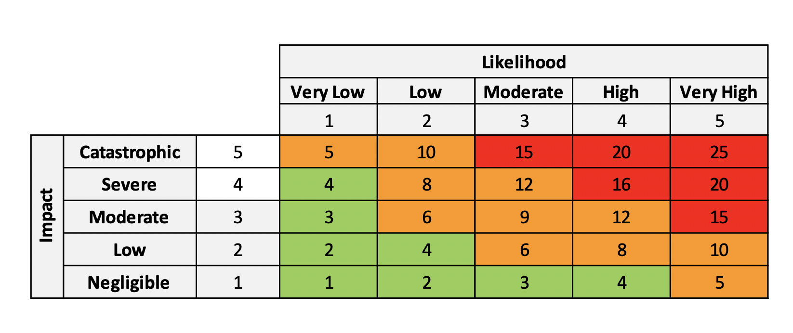

# **Information Security**

| Document Title | Risk Assessment &amp; Treatment Methodology |
| --- | --- |
| Document No. | ISMS-02 |
| Revision No. | 0 |
| Effective Date | 12 December 2020 |
| Classification | Confidential |

## Revision History

| **Date** | **Rev. No.** | **Page No.** | **Description of Amendments** |
| --- | --- | --- | --- |
| 25 Mar 2021 | 0.1 | - | Final version for release |
| 12 Dec 2020 | 0.0 | - | Initial version for release |

### **Prepared By:**
| **Name** | **Designation** | **Date** |
| --- | --- | --- |
| Wayne Tng | Technical Leader | 12 Dec 2020 |

### **Reviewed By :**
| **Name** | **Designation** | **Date** |
| --- | --- | --- |
| SzeTho ChangSheng | Information Security Manager | 12 Dec 2020 |

### **Approved By :**
| **Name** | **Designation** | **Date** |
| --- | --- | --- |
| Jack Cam | Chief Security Officer | 12 Dec 2020 |

# Contents

- [Revision History](#revision-history)

- [Purpose, Scope And Users](#purpose-scope-and-users)

- [Reference Documents](#reference-documents)

- [Validity And Document Management](#validity-and-document-management)

- [Risk Assessment And Risk Treatment Methodology](#risk-assessment-and-risk-treatment-methodology)

  - [Risk Assessment](#risk-assessment)

    - [The Process](#the-process)

  - [Assets, Vulnerabilities and Threats](#assets-vulnerabilities-and-threats)

  - [Determining The Risk Owners](#determining-the-risk-owners)

  - [Consequences, Impact And Likelihood](#consequences-impact-and-likelihood)

  - [Risk Acceptance Criteria](#risk-acceptance-criteria)

  - [Risk Treatment](#risk-treatment)

  - [Regular Reviews Of Risk Assessment And Risk Treatment](#regular-reviews-of-risk-assessment-and-risk-treatment)

  - [Statement of Applicability And Risk Treatment Plan](#statement-of-applicability-and-risk-treatment-plan)

  - [Reporting](#reporting)

- [Records Management](#records-management)

- [Appendices](#appendices)

# Purpose, Scope And Users

1. The purpose of this document is to define the methodology for assessment and treatment of information risks in Agile Lab Pte Ltd (Agile Lab), and to define the acceptable level of risk according to the ISO/IEC 27001 standard.
2. Risk assessment and risk treatment are applied to the entire scope of the Information Security Management System (ISMS), i.e. to all assets which are used within the organization or which could have an impact on information security within the ISMS.
3. Users of this document are all employees of Agile Lab who are involved in the risk assessment and risk treatment.

# Reference Documents

1. ISO/IEC 27001 standard, clauses 6.1.2, 6.1.3, 8.2, and 8.3
2. Information Security Policy
3. List of Legal, Regulatory and Contractual and Other Requirements
4. Supplier Security Policy
5. Statement of Applicability

# Validity And Document Management

1. This document is valid as of the date stated on the cover of this document.
2. The owner of this document is SA; who shall check and, if necessary, update the document at least once a year, before the regular review of existing risk assessment.
3. SA may appoint a deputy to carry out the updating of the documents.
4. When evaluating the effectiveness and adequacy of this document, the following criteria need to be considered:

    1. the number of incidents which occurred, but were not included in risk assessment
    2. the number of risks which were not treated adequately
    3. the number of errors in the risk assessment and risk treatment process because of unclear definition of roles and responsibilities

# Risk Assessment And Risk Treatment Methodology

## Risk Assessment

### The Process

1. Risk assessment is implemented through the Risk Assessment Table.
2. The risk assessment process is coordinated by SA, identification of threats and vulnerabilities is performed by asset owners, and assessment of consequences and likelihood is performed by risk owners.

### Assets, Vulnerabilities and Threats

1. The first step in risk assessment is the identification of all assets in the ISMS scope – i.e. of all assets which may affect confidentiality, integrity and availability of information in the organization. Assets may include documents in paper or electronic form, applications and databases, people, IT equipment, infrastructure, and external services/ outsourced processes. When identifying assets, it is also necessary to identify their owners – the person or organizational unit responsible for each asset.
2. The next step is to identify all threats and vulnerabilities associated with each asset. Threats and vulnerabilities are identified using the catalogues included in the Risk Assessment Table. Every asset may be associated with several threats, and every threat may be associated with several vulnerabilities.

### Determining The Risk Owners

1. For each risk, a risk owner has to be identified – the person or organizational unit responsible for each risk. This person may or may not be the same as the asset owner.

### Consequences, Impact And Likelihood

1. Once risk owners have been identified, it is necessary to assess consequences for each combination of threats and vulnerabilities for the business unit, taking into consideration the consequences on critical information and communications technology (ICT) and operational technology (OT) assets, if such risks materialises. The impact criteria are embedded in the ICT and OT Systems impact category in a common risk assessment template. The impact criteria corresponding to each rating is illustrated below.

| **Impact (Consequence)** | **Rating** | **Description** |
| --- | --- | --- |
| Severe | 5 |- Many or all ICT and/or OT systems or services are unavailable   - Information &amp; data affected (1 or more below occurs):   &nbsp; &nbsp; - Confidentiality: data exposed to public or sold (dark web)   &nbsp; &nbsp; - Integrity: significant volume of critical data (storage &amp;/or transmitted) modified or corrupted   &nbsp; &nbsp; - Availability: essential and critical data are unavailable (deleted and held for ransom)   &nbsp; &nbsp; - Significant impact to the organization on several of the following impact categories – cash flow, operations, legal or contractual obligations, or its reputation. |
| Major | 4 |   - A few critical ICT or OT systems or services are unavailable   - Information &amp; data affected (1 or more below occurs):   &nbsp; &nbsp; - Confidentiality: accessed and/or stolen by hacker   &nbsp; &nbsp; - Integrity: some critical stored data is modified or corrupted   &nbsp; &nbsp; - Availability: essential and critical data are unavailable (locked for ransom) |
| Moderate | 3 | - 1 critical, or a few non-critical, ICT or OT systems or services are unavailable   - Information &amp; data affected (either 1 or both occurs):   &nbsp; &nbsp; - Integrity: some critical stored data is modified or corrupted   &nbsp; &nbsp; - Availability: essential and critical data are unavailable (deleted or locked) |
| Minor | 2 | - &quot;Several non-critical ICT and/or OT systems or services are unavailable   - Information &amp; data affected (either 1 or both occurs):   &nbsp; &nbsp; - Integrity: some non-critical stored and/or transmitted data is modified or corrupted   &nbsp; &nbsp; - Availability: non-critical data are unavailable (deleted or locked) |
| Insignificant | 1 | - Minimal ICT and OT systems or services are disrupted   - Information &amp; data affected (either 1 occurs):   &nbsp; &nbsp; - Integrity: some non-critical stored and/or transmitted data is modified or corrupted   &nbsp; &nbsp; - Availability: non-critical data are unavailable (deleted of locked) |

2. After the assessment of consequences, it is necessary to assess the likelihood of occurrence of such a risk, i.e. the probability that a threat will exploit the vulnerability of the respective asset:

| **Likelihood** | **Rating** | **Description** | **Frequency** | **Frequency**** (Time-to-failure)** |
| --- | --- | --- | --- | --- |
| Almost certain | 5 | Event will definitely occur in most circumstances | 80% to 99% chance of occurring | Risk event will occur within the next year |
| Likely | 4 | Event will likely occur in most circumstances | 50% to 79% chance of occurring | Risk event will occur within the next 2 years |
| Possible | 3 | Event will probably occur in most circumstances | 10% to 49% chance of occurring | Risk event will occur within the next 3 years |
| Unlikely | 2 | Event will occur at some time | 1% to 9% chance of occurring | Risk event will occur within the next 4 years |
| Remote | 1 | Event could occur some time | \&lt; 1% chance of occurring | Risk event will occur beyond the next 4 years |

3. By entering the values of consequence and likelihood into the Risk Assessment Table, the level of risk is calculated by the multiplication of the likelihood and impact values. Existing security controls are to be entered in the last column of the Risk Assessment Table.

## Risk Acceptance Criteria

1. Values 1 to 4 marked as green cells in the diagram below are acceptable risks, which may be reviewed annually or whenever the risk changes significantly.
2. Values from 5 to 12 are acceptable risks that should be monitored more frequently (for example, quarterly) or whenever the risk changes significantly.
3. Values from 15 to 25 are unacceptable risks that must be treated and reduced. A risk treatment plan is required.

## Risk Treatment

1. Risk treatment is implemented through the Risk Treatment Table, which consists of all risks identified as unacceptable from the Risk Assessment Table. Risk treatment is conducted by SA.
2. One or more treatment options must be selected for risks valued 3 and 4:

    1. Selection of security control or controls from Annex A of the ISO/IEC 27001 standard or some other security controls
    2. Transferring the risks to a third party – e.g. by purchasing an insurance policy or signing a contract with suppliers or partners
    3. Avoiding the risk by discontinuing a business activity that causes such risk
    4. Accepting the risk – this option is allowed only if the selection of other risk treatment options would cost more than the potential impact should such risk materialize

3. The selection of options is implemented through the Risk Treatment Table. Usually, option 1 is selected: selection of one or more security controls. When several security controls are selected for a risk, then additional rows are inserted into the table immediately below the row specifying the risk.
4. The treatment of risks related to outsourced processes must be addressed through the contracts with responsible third parties, as specified in Supplier Security Policy.
5. In the case of option 1 (selection of security controls), it is necessary to assess the new value of consequence and likelihood in the Risk Treatment Table, in order to evaluate the effectiveness of planned controls.

## Regular Reviews Of Risk Assessment And Risk Treatment

1. Risk owners must review existing risks and update the Risk Assessment Table and Risk Treatment Table in line with newly identified risks.
2. The review is conducted at least once a year, or more frequently in the case of significant organizational changes, significant change in technology, change of business objectives, changes in the business environment, etc.

## Statement of Applicability And Risk Treatment Plan

1. System Administrator(SA) must document the following in the Statement of Applicability: which security controls from Annex A of the ISO/IEC 27001 standard are applicable and which are not, the justification for such decisions, and whether they are implemented or not.
2. On behalf of the risk owners, Technical Lead (TL) will accept all residual risks through the risk treatment plan and risk assessment.
3. SA will prepare the Risk treatment plan in which the implementation of controls will be planned. On behalf of the risk owners, TL will approve the risk treatment plan.

## Reporting

1. SA will document the results of risk assessment and risk treatment, and all of the subsequent reviews, in the Risk Assessment and Treatment Report.
2. SA will monitor the progress of implementation of the Risk treatment plan and report the results to TL each quarter.

# Records Management

| **Record name** | **Storage location** | **Person responsible for storage** | **Control for record protection** | **Retention time** |
| --- | --- | --- | --- | --- |
| Risk Assessment Table | Cloud directory | TL | Only TL has the right to make entries into and changes to the Risk Assessment Table | Data is stored permanently |
| Risk Assessment and Treatment Report | Cloud directory | TL | The Report is prepared in read-only PDF format | The Report is stored for a period of 1 year |
| Risk treatment plan | Cloud directory | TL | Only TL has the right to make entries into and changes to the Risk treatment plan | Older versions of Risk treatment plan are stored for a period of 1 year |

Only the TL can grant other employees access to any of the abovementioned documents.

# Appendices

1. Appendix 1: Form – Risk Assessment and Treatment Template
2. Appendix 2: Form – Vulnerability Assessment and Penetration Test Report
