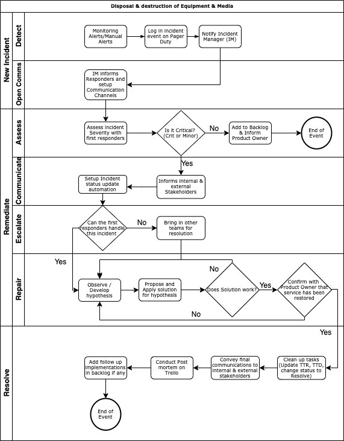

 **Internal** 

# **Information Security**

| Document Title | Incident Management Procedure |
| --- | --- |
| Organization Name | Agile Lab |
| Document No. | ISMS-13 |
| Revision No. | 0.3 |
| Effective Date | 12 December 2020 |
| Classification | Internal |

## Revision History

| **Date** | **Rev. No.** | **Page No.** | **Description of Amendments** |
| --- | --- | --- | --- |
| 03 Apr 2021 | 0.2 | - | Content update |
| 31 Mar 2021 | 0.2 | - | Content update |
| 25 Mar 2021 | 0.1 | - | Final version for release |
| 12 Dec 2020 | 0.0 | - | Initial version for release |

### **Prepared By:**
| **Name** | **Designation** | **Date** |
| --- | --- | --- |
| Wayne Tng | Technical Leader | 12 Dec 2020 |

### **Reviewed By :**
| **Name** | **Designation** | **Date** |
| --- | --- | --- |
| SzeTho ChangSheng | Information Security Manager | 12 Dec 2020 |

### **Approved By :**
| **Name** | **Designation** | **Date** |
| --- | --- | --- |
| Jack Cam | Chief Security Officer | 12 Dec 2020 |

# Contents

- [Revision History](#revision-history)

- [Purpose, Scope And Users](#purpose-scope-and-users)

- [Reference Documents](#reference-documents)

- [Validity And Document Management](#validity-and-document-management)

- [Incident Management](#incident-management)

  - [Receipt And Classification Of Incidents, Weaknesses And Events](#receipt-and-classification-of-incidents-weaknesses-and-events)

  - [Treatment Process For Security Weaknesses Or Events](#treatment-process-for-security-weakness-or-events)

  - [Treating Minor Incidents](#treating-minor-incidents)

  - [Treating Major Incidents](#treating-major-incidents)

  - [Learning From Incidents](#learning-from-incidents)

  - [Disciplinary Actions](#disciplinary-actions)

  - [Collection Of Evidence](#collection-of-evidence)

- [Records Management](#records-management)

- [Appendices](#appendices)

# Purpose, Scope And Users

1. The purpose of this document is to ensure quick detection of security events and weaknesses, and quick reaction and response to security incidents.
2. This document is applied to the entire Information Security Management System (ISMS) scope, i.e. to all employees and other assets used within the ISMS scope, as well as to suppliers and other persons outside the organization who come into contact with systems and information within the ISMS scope.
3. Users of this document are all employees of Agile Lab Pte Ltd (Agile Lab).

# Reference Documents

1. ISO/IEC 27001 standard, clauses A.7.2.3, A.16.1.1, A.6.1.2, A.16.1.3, A.16.1.4, A.16.1.5, A.16.1.6, A.16.1.7
2. Information Security Policy
3. List of Legal, Regulatory, Contractual and Other Requirements

# Validity And Document Management

1. This document is valid as of the date stated on the cover of this document.
2. The owner of this document is Technical Leader (TL), who must check and, if necessary, update the document at least once a year, before the regular review of existing risk assessment.
3. TL may appoint a deputy to update the documents.
4. When evaluating the effectiveness and adequacy of this document, the following criteria must be considered:

1. number of weaknesses or incidents which were not reported to authorized persons
2. number of incidents which were not treated in the most adequate manner
3. number of incidents which were not recorded in the Incident Log
4. number of incidents for which evidence for legal action was inadequate
5. number of violations of security rules where no disciplinary process was invoked

# Incident Management

1. An information security incident is a single or a series of unwanted or unexpected information security events that have a significant probability of compromising business operations and threatening information security.
2. Incidents affecting office automation, application systems (services), ICT/IS assets and network infrastructure shall be managed by the TL, or his/her appointed deputy.

## Receipt And Classification Of Incidents, Weaknesses And Events

1. All employees, supplier or other third party who is in contact with information and/or systems of Agile Lab must report any system weakness, incident or event which could lead to a possible incident must be reported to Manager or his/her appointed deputy or email to report@agilelab.sg
2. Incidents, weaknesses and events must be reported as soon as possible, by informing the manager to report incidents and create a ticket on [PagerDuty](https://www.pagerduty.com); which may be followed via phone or in person.
3. Users may report phishing, spam and malicious email by sending to report@agilelab.sg
4. The person who received the information must classify it in the following way:

    1. security weakness(vulnerability) or event – no incident occurred, but the event related to a system, process or organization may trigger the occurrence of an incident in the near or further future
    2. minor incident – an incident which cannot significantly impact confidentiality or integrity of information, and cannot cause long-term unavailability
    3. critical incident – an incident which can incur significant damage due to loss of confidentiality or integrity of information, or may cause an interruption in the availability of information and/or processes for an unacceptable period of time

## Treatment Process For Security Weaknesses Or Events

1. The person who received the information about a security weakness or event analyzes the information, establishes the cause and, if necessary, suggests preventive and corrective action.

## Treating Minor Incidents

1. If a minor incident was reported, the person who received the information must take the following steps:

    1. Report the fault to Manager/TL
    2. Manager/TL will create an incident in PagerDuty
    3. inform persons who were involved in the incident, as well as , about the incident treatment process
    4. analyze the cause of the incident
    5. take corrective actions to eliminate the cause of the incident

3. For office automation systems, ICT assets, application systems (services) and network infrastructure, the TL, or an appointed deputy, will record the incident in PagerDuty.

## Treating Critical Incidents

1. In the case of critical incidents that could disrupt activities for an unacceptable period of time, an incident response process, which may be part of the Business Continuity Plan activation, will be invoked.

    1. Report the fault to Manager/TL
    2. Manager/TL will create an incident in PagerDuty
    3. inform persons who were involved in the incident, as well as , about the incident treatment process
    4. analyze the cause of the incident
    5. take corrective actions to eliminate the cause of the incident

## Learning From Incidents

1. TL or SA must review all minor incidents every three months, and enter recurring ones, or those which may turn into major incidents on the next occasion, in the PagerDuty.
2. TL or SA must analyze each incident recorded in the PagerDuty Incident Log (identifying type, relatedness, and cost of incident) and, if necessary, suggest preventive or corrective action.

## Disciplinary Actions

1. TL or SA must invoke a disciplinary process for each violation of security rules.

## Collection Of Evidence

1. TL will define the rules on how to identify, collect and preserve evidence that will be accepted as evidence in legal and other proceedings.
2. TL or SA can grant other employees access to the records belonging to another employee.

# Records Management

| **Record name** | **Storage location** | **Person responsible for storage** | **Controls for record protection** | **Retention time** |
| --- | --- | --- | --- | --- |
| Incident Log | [PagerDuty](https://pagerduty.com) | TL | TL | 1 year |
| Post Morterm | Cloud Directory | TL | Only TL or his/her appointed deputy has the right to edit and update the post morterm | 1 year |

# Appendices

 **Internal** 

