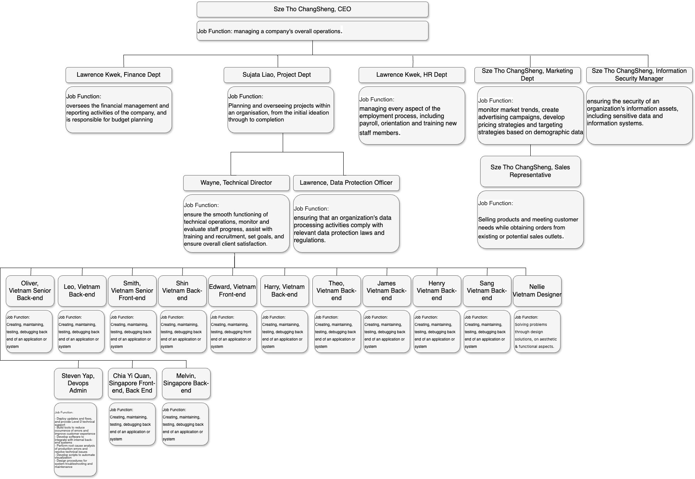
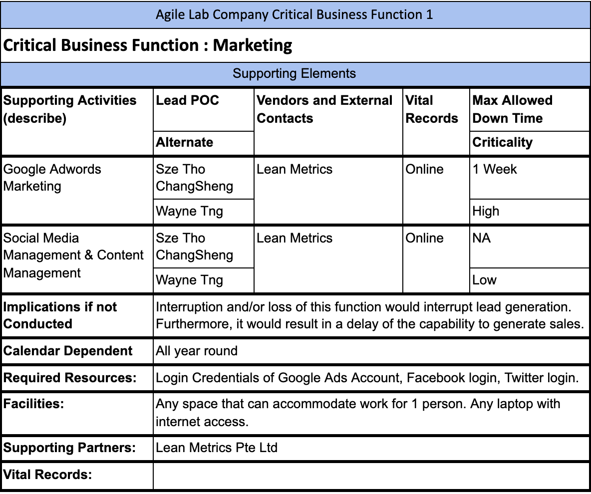
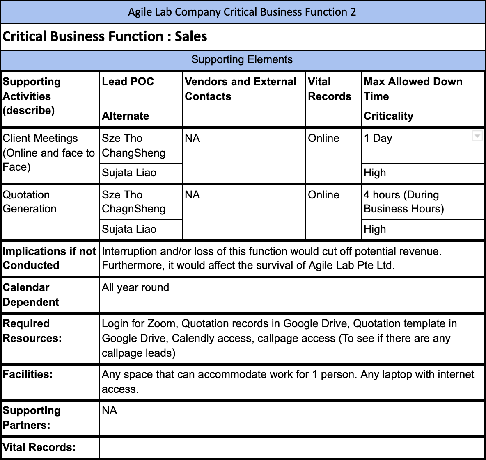
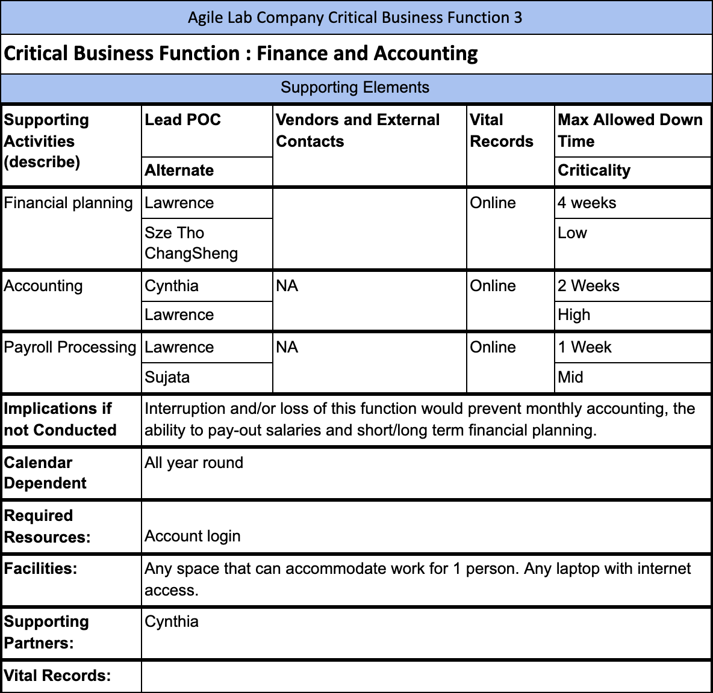
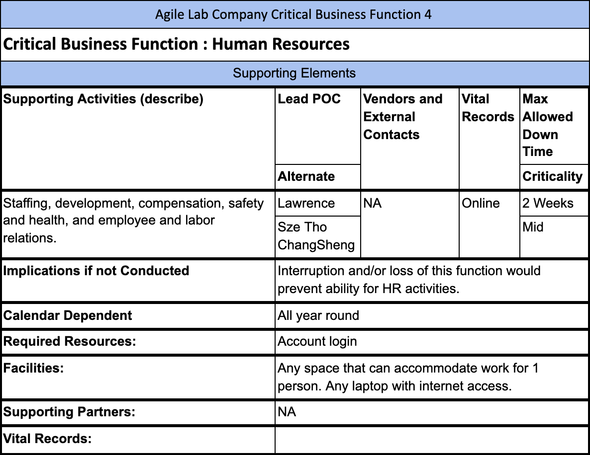
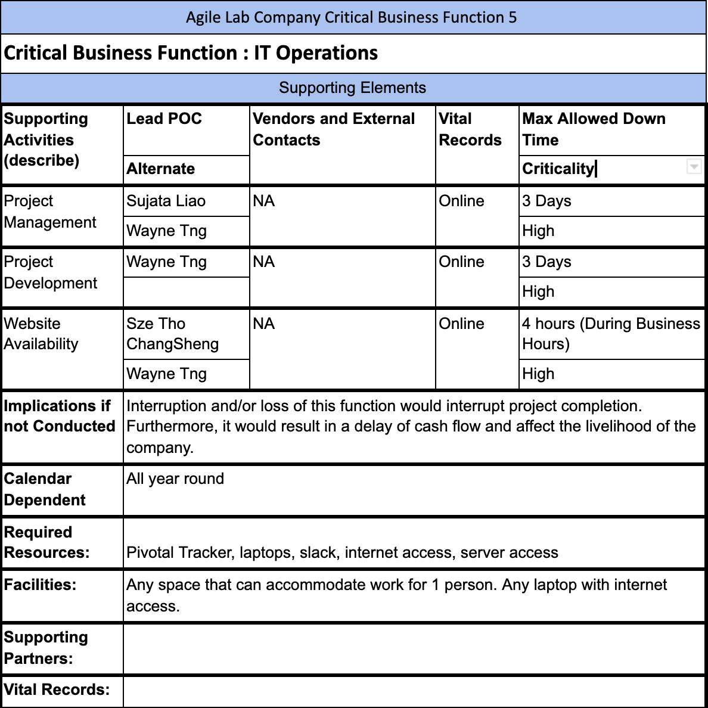

 **Internal** 

# **Business Continuity Plan**

| Document Title    | Business Continuity Plan |
| ----------------- | ------------------------ |
| Organization Name | Agile Lab                |
| Document No.      | BCP                      |
| Revision No.      | 0.7                      |
| Effective Date    | 20 April 2021            |
| Classification    | Internal                 |

## Revision History

| **Date**    | **Rev. No.** | **Page No.** | **Description of Amendments**    |
| ----------- | ------------ | ------------ | -------------------------------- |
| 07 Apr 2025 | 0.7          | -            | Yearly review + Update Org Chart |
| 08 Apr 2024 | 0.6          | -            | Yearly review                    |
| 03 May 2023 | 0.5          | -            | Yearly review                    |
| 25 Apr 2022 | 0.4          | -            | Yearly review                    |
| 20 Apr 2021 | 0.3          | -            | Added PDPC regulations           |
| 12 Apr 2021 | 0.2          | -            | Update Approved By               |
| 08 Apr 2021 | 0.1          | -            | Content update                   |
| 12 Dec 2020 | 0.0          | -            | Initial version for release      |

### **Prepared By:**

| **Name**  | **Designation**  | **Date**    |
| --------- | ---------------- | ----------- |
| Wayne Tng | Technical Leader | 20 Apr 2021 |
| Wayne Tng | Technical Leader | 25 Apr 2022 |
| Wayne Tng | Technical Leader | 03 May 2023 |
| Wayne Tng | Technical Leader | 08 Apr 2024 |
| Wayne Tng | Technical Leader | 07 Apr 2025 |

### **Reviewed By :**

| **Name**          | **Designation**              | **Date**    |
| ----------------- | ---------------------------- | ----------- |
| SzeTho ChangSheng | Information Security Manager | 20 Apr 2021 |
| SzeTho ChangSheng | Information Security Manager | 29 Apr 2022 |
| SzeTho ChangSheng | Information Security Manager | 05 May 2023 |
| SzeTho ChangSheng | Information Security Manager | 22 Apr 2024 |
| SzeTho ChangSheng | Information Security Manager | 14 Apr 2025 |

### **Approved By :**

| **Name**    | **Designation** | **Date**    |
| ----------- | --------------- | ----------- |
| Sujata Liao | Director        | 20 Apr 2021 |
| Sujata Liao | Director        | 29 Apr 2022 |
| Sujata Liao | Director        | 05 May 2023 |
| Sujata Liao | Director        | 22 Apr 2024 |
| Sujata Liao | Director        | 14 Apr 2025 |

## Contents

- [Revision History](#revision-history)

- [Purpose, Scope And Users](#purpose-scope-and-users)

- [Reference Documents](#reference-documents)

- [Validity And Document Management](#validity-and-document-management)

- [Plan Objectives](#plan-objectives)

- [Risk Assessment](#risk-assessment)

- [Critical Business Function](#critical-business-function)

- [Stages of Activation](#stages-of-activation)

- [Plan Activation Procedures](#plan-activation-procedures)

- [Internal Communication Procedures](#internal-communication-procedures)

- [Alternate Facilities](#alternate-facilities)

- [Orders of succession and delegations of authority](#orders-of-succession-and-delegations-of-authority)

- [Plan Deactivation](#plan-deactivation)

- [Vendors](#vendors)

- [Managing Records](#managing-records)

## Purpose, Scope And Users

- The Scope of this plan covers Agile Lab Pte Ltd.
- The plan is applicable once the life safety of employees, customers, and guests has been verified and in the event that a facility is or will become inaccessible. It can be active during normal business hours and after hours, with and without warning.
- Users of this document are all employees of Agile Lab Pte Ltd (Agile Lab).

## Reference Documents

- ISO/IEC 27001 standard, clause 10.1
- Information Security Policy
- Internal audit procedure
- Incident management procedure

## Validity And Document Management

- This document is valid as of the date stated on the cover of this document.
- The owner of this document is Information Security Manager (ISM), who must check and, if necessary, update the document at least once a year.
- When evaluating the effectiveness and adequacy of this document, the following criteria need to be considered:

  1. number of initiated corrective actions
  2. number of incomplete corrective actions
  3. number of corrective actions taken without having been recorded in a designated form

## Plan Objectives

### Objectives

The Agile Lab Business Continuity plan objective is to facilitate the resumption of critical operations, functions and technology in a timely and organized manner to ensure a viable and stable organization.

It is critical to ensure the safety and well-being of employees and customers.

### Primary Objectives

1. Maintain Critical Business Functions (Most critical department/business functions)
2. Ensure employees are able to access an alternate facility (Ensure that employees have safe access to facility)
3. Protect vital records (Ensure that they are accessible under all conditions)

### Plans Assumptions

**The following assumptions were used while creating this plan:**

- An event has occurred that affects normal business operations
- There is limited or no access to the affected facility.
- Documents and equipment within the facility are in accessible
- Qualified personnel are available to continue operations

### Risk Assessment

The following are the list of threats.

[Risk Assessment - Risk Treatment Plan](https://docs.google.com/spreadsheets/d/1EyU_gaj989j_VK57SHhoykrAziduvBOq)

## Critical Business Functions

### Overview

Critical business functions are those functions and critical activities that an organization must maintain in a continuity situation, when there has been a disruption to normal operations, in order to sustain the mission of the organization, comply with legal requirements and support life-safety. They are the backbone of a business and must be continued in order for the organization to meet its mission. These functions are not meant to be the name of a division, program, unit, etc. but meant to be the actual process/function that must be continued.

## Stages of Activation

### Stage 0 – Normal Operations

Business is operating as usual. No disruption is observed.

### Stage 1 – Monitoring the Situation

Potential threats are identified (e.g. health outbreak, system vulnerability, extreme weather, etc.).

### Stage 2 – Active Preparation

Triggers indicate a higher risk of disruption.

- Employees are reminded of BCP protocols.
- Alternate work locations and equipment are validated.
- Critical backups, access credentials, and documents are reviewed.
- Communication plans are primed.

### Stage 3 – Partial Activation

Some disruption has occurred.

- Specific business functions (e.g. Sales, DevOps) switch to remote or alternate mode.
- Emergency roles are activated (e.g. IT lead, HR lead).
- Internal communication and coordination procedures are in motion.

### Stage 4 – Full Activation

Widespread or total disruption of facility or systems.

- Entire company operates from alternate sites (e.g. full remote operations).
- Succession roles take over if leadership is unavailable.
- All critical business functions resume per defined recovery time.

### Stage 5 – Deactivation & Return to Normal

- Issue is resolved and risk level reduced.
- Operations return to primary sites and standard processes.
- Post-mortem and improvement review is conducted.

## Plan Activation Procedures

### Plan activation during Normal Business Hours

If it is determined that the facility cannot be re-inhabited, the Business Owner or designee will inform personnel on next steps. Employees will be instructed to go home to await further instructions or to activate the Business Continuity Plan. Further communications, such as instructions on where and when to report for work will utilize the [communication procedures](#internal-communication-procedures)

### Plan activation outside Normal Business Hours

If an event occurs outside normal business hours that renders a facility uninhabitable, the Business Owner or designee will activate the Business Continuity Plan using the [communication procedures](#internal-communication-procedures)

### Actions upon Activation

Upon activation of the Business Continuity Plan, the Business Owner or designee will be responsible for notifying the alternate site, if appropriate, of their impending arrival.

[Guide on managing and notifying data breaches under the PDPA](https://www.pdpc.gov.sg/-/media/Files/PDPC/PDF-Files/Other-Guides/Guide-on-Managing-and-Notifying-Data-Breaches-under-the-PDPA-15-Mar-2021.pdf?la=en)

## Internal Communication Procedures

### Staff Accountability

Once employees, customers, and guests have evacuated personnel should remain at the primary assembly point and await further instructions.

**Once at the assembly point accountability must be performed:**

- Initiate headcount and make note of missing and/or injured employees, customers and guests; and
- Report missing and/or injured employees to the Business Owner or designee. This information should be shared with emergency first responders on scene.

The Business Owner or designee should determine the best methods for disseminating communications to staff.

### Employee Contact List.

[Employee Contacts](https://docs.google.com/spreadsheets/d/1kRf8DYuAAOWTwffl7Wy43KO88n8ZrmcA7J_3jzZc834)

## Alternate Facilities

### Telework as an alternate site

Agile Lab uses teleworking as our alternate site strategy. Agile Lab employees will work from home or other non-traditional location deem fit by the employee. VPN must always be switched on when using a public wireless network.

## Orders of succession and delegations of authority

Orders of succession are pre prepared to provide clarity of senior leadership roles in the event that individuals in these roles, whether they will be decision-making or management roles are unavailable. A delegation authority provides successors with the legal authorization to act on behalf of critical positions within the organisation for specific purposes and duties.

| Position to be Succeeded | Successors         | Delegated Authorities | Activation and Termination Triggers                                                                  |
| ------------------------ | ------------------ | --------------------- | ---------------------------------------------------------------------------------------------------- |
| Marketing                | Wayne Tng          | Delegated authorities | Activate: Incapacitated, unavailable or selective decision     Terminate: Return of Director |
| Sales                    | Sujata Liao        | Delegated authorities | Activate: Incapacitated, unavailable or selective decision     Terminate: Return of Director |
| Finance/Accounting       | Cynthia            | All duties assigned   | Activate: Incapacitated, unavailable or selective decision     Terminate: Return of Director |
| Human Resources          | Sze Tho ChangSheng | Delegated authorities | Activate: Incapacitated, unavailable or selective decision     Terminate: Return of Director |
| IT Operations            | Wayne Tng          | Delegated authorities | Activate: Incapacitated, unavailable or selective decision     Terminate: Return of Director |

## Plan Deactivation

The goal of plan deactivation is to re-establish full capability in the most efficient manner. All personnel should be informed that the necessity for continuity operations no longer exists and the return to normal operations will begin.

Business function will resume once the management decides on a new/existing employee to take over the position permanently and ensure there are enough human resources to manage all tasks needed for the business function(s) to resume properly.

## Vendors

[External Contacts](https://docs.google.com/spreadsheets/d/11b1ZbclzYwSC3ky8zxoWoIfQcWztTNrF6DWMxHJY3LU/edit#gid=967295095)

## Managing Records

| **Record name**        | **Storage location** | **Person responsible for storage** | **Control for record protection**                                               | **Retention time** |
| ---------------------- | -------------------- | ---------------------------------- | ------------------------------------------------------------------------------- | ------------------ |
| Corrective action form | Cloud Directory      | TL                                 | After all data has been recorded, any new additions or editing must be disabled | 1 year             |

 **Internal** 

